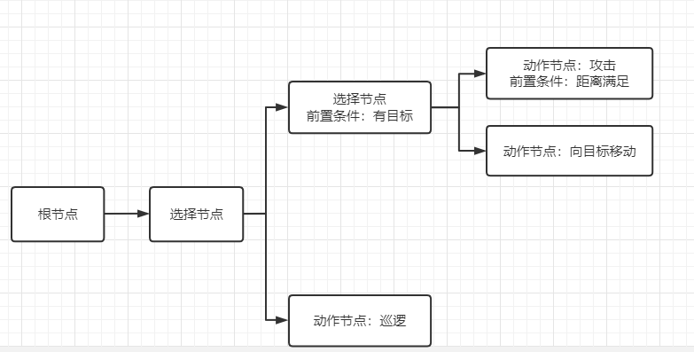
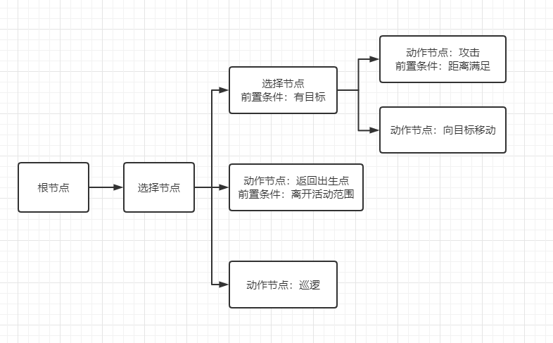
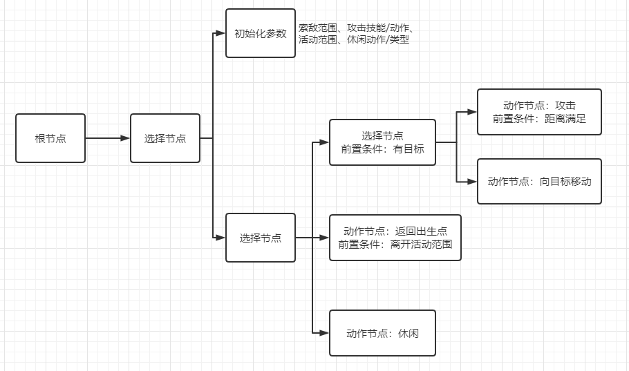
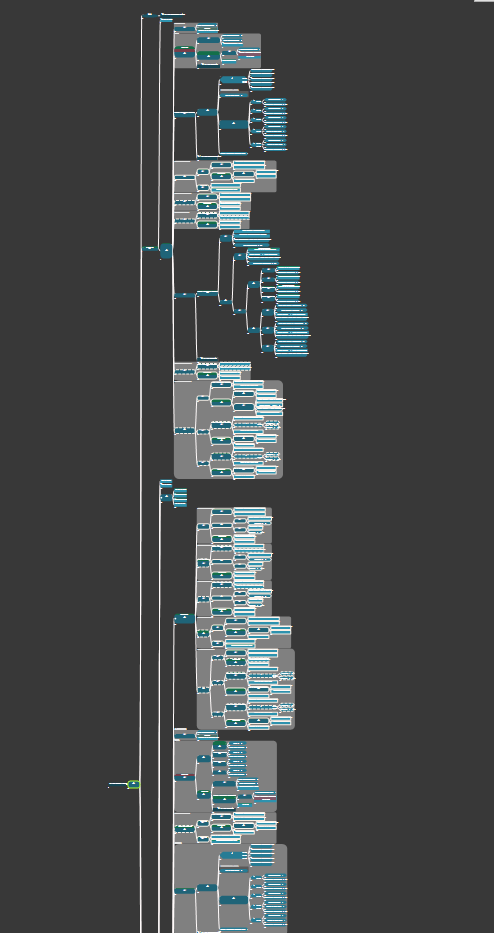
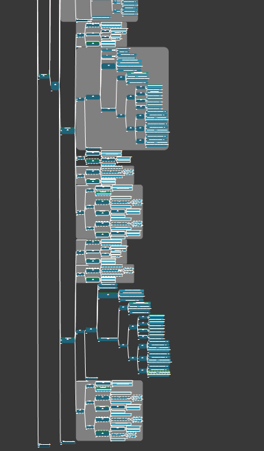
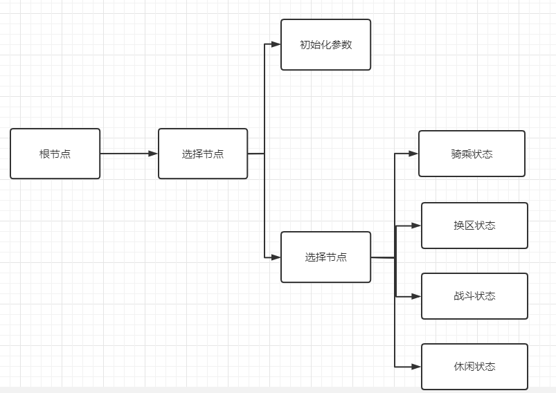
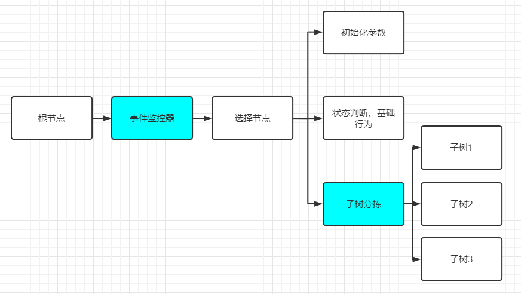
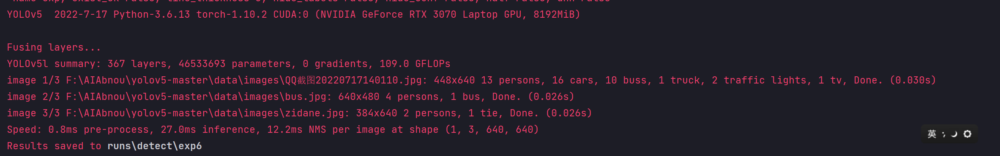

# 来个标题

## 先自我介绍一下

## 想聊些什么

- 从项目应用的层面，聊一聊行为树的功能结构设计
- 机器学习在游戏中的一些应用

## 先看行为树

### 1.0

假设我们需要一个简单的怪物行为树；遇到敌人会主动攻击，否则巡逻  

### 1.1

行为逻辑的设计是上面这样，但是具体使用时会发现一些问题
比如发现如果玩家引怪后离开，怪物的位置就会不断变化，所以我们需要为它划定活动范围  

### 1.2

进行拓展设计之前，为了方便复用和参数管理，简单的加一个初始化模块，对整个AI实体的参数进行初始化
目前需要管理的参数不多，如图  

  

这个时候，一个简单且可复用的小怪AI框架基本上已经成形；
在实际使用中针对不同的应用场景进行一些修饰，例如：
- 攻击成功后，概率向反方向随机移动
- 为返回出生点增加一个timer锁，来避免被玩家拉得在边界反复折返
- 为巡逻增加路点设置，或新增巡逻算法；而不是随机移动

**复用性：**
我们可以通过复制树并修改参数的方式，将其应用到不同的小怪身上
或者直接在初始化模块中，读取静态数据（例如json、csv、html）进行初始化

### 2.0

上面是行为模式非常简单的行为树，也是比较传统的单纯使用行为树思路进行设计的一个小栗子
但是当AI的行为变得更加复杂，例如加入了复杂的战斗逻辑、生态展示等，整个树的结构会变得臃肿难读且不易调整，**主要是不易调整**  

  

（上面那个比较夸张，其实如果项目本身对行为树的数量需求不大，这种模式进行迭代还是可以跑得动的）
这时候就需要一些方案来解决：单纯使用行为树进行行为控制，树状结构复杂程度的问题

**分状态设计**：
最简单直白的思路是模块化
即将怪物的行为分为几种状态，只需要想清楚状态之间的切换条件，就可以将不同的复杂行为模块结合起来
*抽象点说，这就是顶层由状态机分拣状态，底层由行为树分拣行为的设计*  

### 2.1

出于即时反应和便于管理的思路，这里的状态切换一般会使用子树结合监控+任务，或其他的设计来实现
（纯行为树中如果存在需要running的节点，就有可能出现无法即时针对输入做出反应的情况）
一个解决方案的栗子：  

  

**子树分拣：**
    核心思想是能够实时根据外界环境，选择最适合当前的子树（状态）
    1. 定义每一个子树的达成条件及优先级，多个子树均满足条件时进入优先级高的子树
    2. 采用意愿值系统，每一个子树有自己的意愿值，且有修改意愿值的条件+修改值；分拣当前意愿值最高的子树
        *拓展：可以再加入惯性意愿值，即只要进入了这棵子树，该子树的意愿值上升，保证一定的决策惯性

## 来点机器学习

### 简单介绍一下机器学习是什么

人通过**算法**，指导机器对已有的**数据**进行学习，进而总结出**经验(模型)**

监督学习、无监督学习、强化学习

监督学习：  

- 学习的数据包含数据本身+预期的输出  
- 机器自行计算，根据每次得出的结果与预期输出的差，调整自身参数
- 依此循环，最后得到一个可以较高概率拟合预期输出的处理数据的模型
- 主要用于明确的分类、识别，或者预测（其实就是离散或回归的数学问题）

无监督学习：

- 没有预期输出
- 一种无监督学习：机器自行尝试对数据进行分类，假设有K类，不断寻找能将分散的数据合理划分的中心点，最终得到聚类
- 可以快速分类数据  

强化学习：  

- 总结得出基于当前环境，收益最高的动作
- 尤其是免模型强化学习，更具有一般性

以监督学习为例，通过CIRF数据集简单训练一个识别图片的模型

### 机器学习与游戏

监督学习：  

- 一般用于各种识别：人脸识别、手写体识别
- 或者游戏局势预测：dota大老师、lol KI上校

强化学习：

- 与玩家对弈，例如AlphaGo、dota的OpenAI Five

### 实际落地应用

主要是针对强化学习的模型  

在游戏中的大规模应用主要面临两个问题：  
    1.训练、部署和运维成本  
    复杂游戏中的强化学习模型训练成本普遍极高  
    2.性能问题  
    主要是针对部署离线模型，强化学习模型一般复杂度很高，如果在客户端（主流手机）做运算，尤其是moba游戏中如果一局要跑9个深度AI，对低端机来说是非常大的性能负担
    