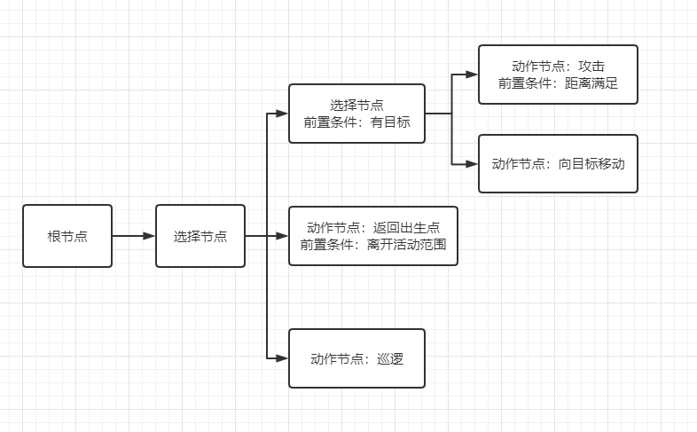
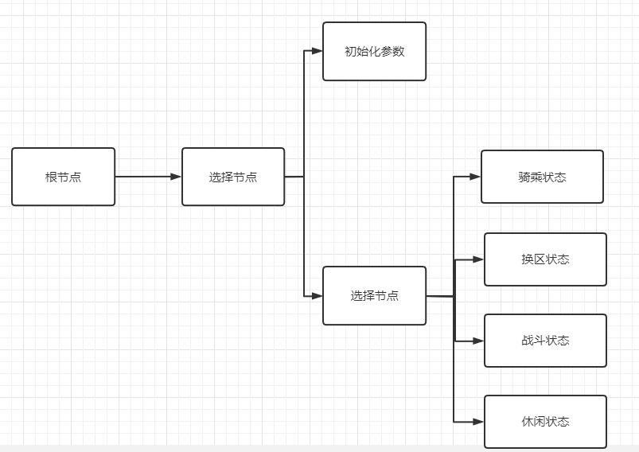
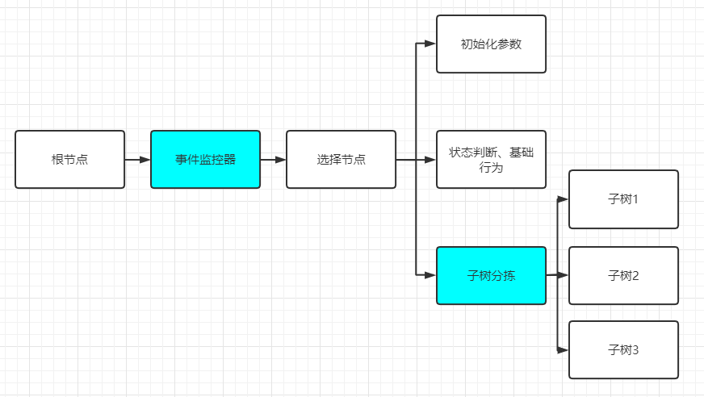

## 0.0

先来简单说下这个文档聊些什么：

- 我个人理解行的为树本身只是一种较为通用的逻辑结构，它可以清晰地指导一个智能实体的行为，且可以较为直观地编辑
- 这里我们聊比较狭义的行为树AI，即游戏内主要靠行为树这种逻辑结构来分拣行为的实体；例如一只会攻击和其他基础行为的怪物
- 在实际的工程运用中，不同的项目会基于各种需求，对“行为树”或者“如何指导智能实体行动”有细节上不同的解决方案，一切功能设计的出发点都应该是实际的内容设计；
  - 例如一个MMO项目，需要制作大量不同的怪物，且同一种外形的怪物会有变种和特殊个体，那么在进行行为树的功能架构设计时，就应该更注重模块化以提升复用性
  - 此外，一棵树如何去遍历、是否需要跳转中断和事件监控、行为树的遍历频率；客户端行为树的性能、服务器行为树如何处理失败的oper等等问题，也都是实际应用需要考虑或了解的

行为树这种逻辑结构的基础概念不会细聊，下面的内容看不懂还是建议百度一下行为树

*这里还有一篇文章推荐：[点我](https://indienova.com/indie-game-development/ai-behavior-trees-how-they-work/)

## 1.0

假设我们需要一个简单的怪物行为树；遇到敌人会主动攻击，否则巡逻  

非常单纯的行为树分拣行为的结构

将：攻击、移动、巡逻三种行为，按照条件+优先级的形式组合起来

- 首先选择节点决定了处于下方的“巡逻”在最低优先级，只有上面所有行为的条件都不满足，才会巡逻
- 当存在目标时，如果满足距离，则会使用攻击；否则移动

## 1.1

行为逻辑的设计是上面这样，但是具体使用时会发现一些问题

比如发现如果玩家引怪后离开，怪物的位置就会不断变化，所以我们需要为它划定活动范围  

## 1.2

进行拓展设计之前，为了方便复用和参数管理，简单的加一个初始化模块，对整个AI实体的参数进行初始化

目前需要管理的参数不多，如图  

  

简单说下初始化模块，一般两种处理方式：

1. 定义一个初始值为false的全局变量isInit，isInit == false 才会进入初始化节点，且初始化结束后将isInit置为true
2. (要看项目具体加载行为树的方式)，如果根节点时agent的初始化只在创建实例时执行一次，则可以直接在此处进行初始化

这个时候，一个简单且可复用的小怪AI框架基本上已经成形；
在实际使用中针对不同的应用场景进行一些修饰，例如：

- 攻击成功后，概率向反方向随机移动
- 为返回出生点增加一个timer锁，来避免被玩家拉得在边界反复折返
- 为巡逻增加路点设置，或新增巡逻算法；而不是随机移动

**复用性：**
我们可以通过复制树并修改参数的方式，将其应用到不同的小怪身上
或者直接在初始化模块中，读取静态数据（例如json、csv、html）进行初始化

## 1.3

具体来看一种召唤物行为树的结构

整体的行为流程：

- 首次创建时进行参数的初始化
- 依次按照索敌条件，得到当前优先级最高的目标，存在全局变量(假设变量叫target)
  - 越靠后执行的索敌函数(条件)优先级越高，因为赋值同一个变量会覆盖
  - 条件例如：离主人最近的、攻击自己的、攻击主人的、主人正在攻击的
- 完成了逻辑层面的目标查找，开始进行实际动作，动作是选择节点，保证每次只决策一个实际动作：
- 首先判断是否超出了最大活动范围，如果超出会直接传送到主人坐标
- 如果目标(target)不为空，进入追击目标相关的动作：
  - 判断距离满足则按优先级进行攻击动作
  - 否则向目标移动
- 攻击动作可以有多组，只要有任意一个返回成功，本次循环结束
- 如果没有目标，会是跟随模式，首先判断是否离主人过近，过近则停止移动
- 否则跟随主人

一些优化点：

- 跟随主人由于是即时的，如果主人一走一停，召唤物表现会比较丑，两种解决方案
  - 动作制作上做缓存，即动作本身缓起
  - 行为树的移动向主人节点添加timer冷却，但是注意返回值的处理

## 2.0

上面是行为模式非常简单的行为树，也是比较传统的单纯使用行为树思路进行设计的一个小栗子
但是当AI的行为变得更加复杂，例如加入了复杂的战斗逻辑、生态展示等，整个树的结构会变得臃肿难读且不易调整，**主要是不易调整**  

  

（上面那个比较夸张，其实如果项目本身对行为树的数量需求不大，这种模式进行迭代还是可以跑得动的）
这时候就需要一些方案来解决：单纯使用行为树进行行为控制，树状结构复杂程度的问题

**分状态设计**：
最简单直白的思路是模块化
即将怪物的行为分为几种状态，只需要想清楚状态之间的切换条件，就可以将不同的复杂行为模块结合起来
*抽象点说，这就是顶层由状态机分拣状态，底层由行为树分拣行为的设计*  

## 2.1

- 出于即时反应和便于管理的思路，这里的状态切换一般会使用子树结合监控+任务来实现
- 纯行为树中如果存在需要running的节点，就有可能出现无法即时针对输入做出反应的情况
- 所以另外一种解决方案就是，没有需要running的节点，行为树只发送指令，从而不会出现动作执行中，导致行为树无法即时决策

一个监控+任务来实现的解决方案的栗子：  

  

**子树分拣：**
    核心思想是能够实时根据外界环境，选择最适合当前的子树（状态）

    1. 定义每一个子树的达成条件及优先级，多个子树均满足条件时进入优先级高的子树
    2. 采用意愿值系统，每一个子树有自己的意愿值，且有修改意愿值的条件+修改值；分拣当前意愿值最高的子树
        *拓展：可以再加入惯性意愿值，即只要进入了这棵子树，该子树的意愿值上升，保证一定的决策惯性
